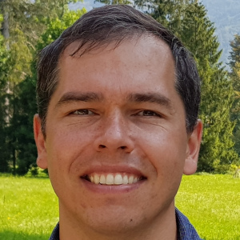

## About

My name is Konstantin Selyunin, 
I am a software developer and tech enthusiast, 
especially interested in eye-tracking, robotics, 3-D perception,
object recognition, embedded systems, automotive ECU development, and FPGAs. 

After finishing my PhD at 
[**TU Vienna**](https://www.tuwien.at/)
[**Cyber Physical Systems Group**](https://ti.tuwien.ac.at/), 
I worked in a startup specializing in in-door localization (2018-19);
Robert Bosch automotive ECU development (2019-21); and again a startup 
specializing in eye-tracking (2022-).

## Research Interests

* runtime monitoring of temporal logic specifications;
* hardware runtime monitoring;
* eye-tracking.

## Publications

## Additional courses and projects

